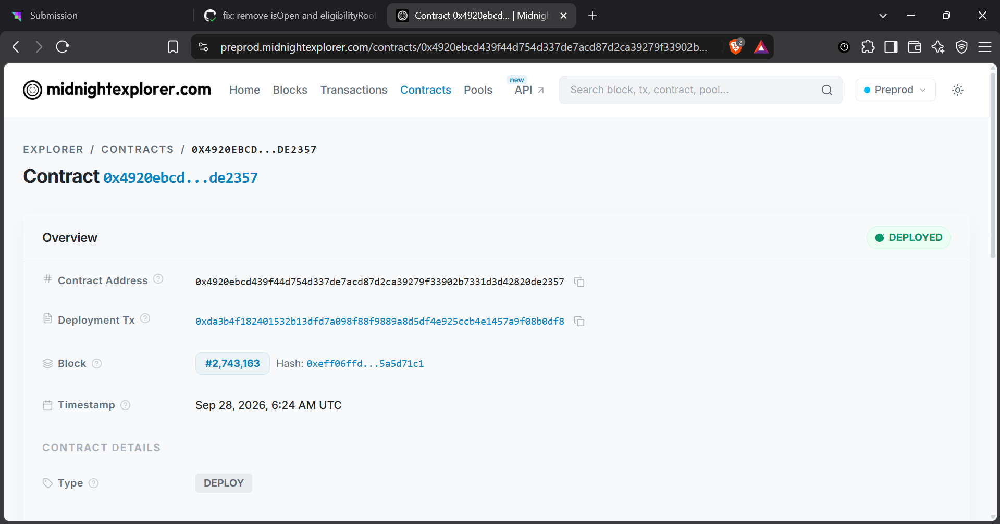
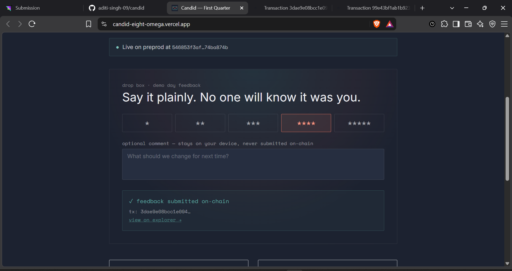
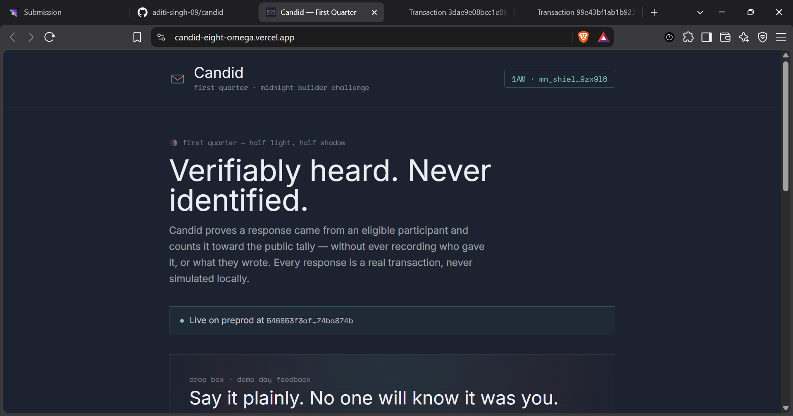
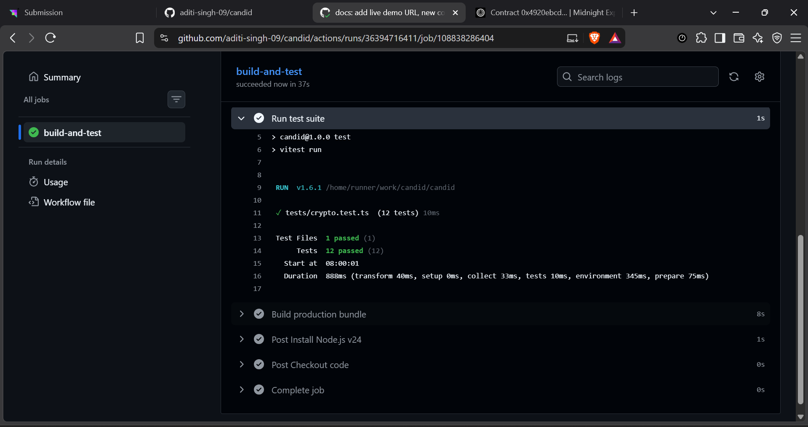

# Candid
[](https://github.com/aditi-singh-09/candid/actions/workflows/ci.yml)
> Verifiable participation, private responses. Built on Midnight.

### 🌟 Quick Links for Reviewers
- 📄 **[Read the full Product Proposal (PROPOSAL.md)](./PROPOSAL.md)**
- 🧪 **[View the Test Suite (Circuit, Logic, & Privacy Tests)](./tests)**
- 🕵️ **[Read our Privacy Model & Claims](#privacy-model)**

## Live Demo
https://candid-eight-omega.vercel.app

## Demo Video
🎥 [Watch the 1-Minute Walkthrough Video (Google Drive)](https://drive.google.com/file/d/1lAxUMkWKKGOEJCiyO4Xxx7TrAWfYaKxI/view?usp=sharing)

## Contract Address
| Network  | Address                          |
|----------|----------------------------------|
| Preprod  | `546853f3af9c33431e31d9ccffa918c8028c06147a09210e196c6ea674ba874b` |

- 🔍 **Contract on Midnight Explorer:** [View Preprod Contract](https://preprod.midnightexplorer.com/contracts/0x4920ebcd439f44d754d337de7acd87d2ca39279f33902b7331d3d42820de2357)
- ⚡ **Confirmed On-Chain Transaction:** [View Extrinsic on 1AM Explorer](https://explorer.1am.xyz/tx/99e43bf1ab1b923bd3cc68fd8cb802ed3b8a8ffb61b6ba74c3e6a02eed90adbf?network=preprod)



## What This Does
Candid lets an organizer run a survey where every response is provably from an eligible, un-reused respondent, while the response itself — the rating and any free-text comment — is never linked back to that respondent. Only the aggregate 1-5 star distribution and a comment count are ever public.

The application generates a client-side zero-knowledge proof, pays network fees using Midnight tDUST, balances the transaction with 1AM Wallet or Lace, and submits the proof on-chain to the Preprod network, leaving only a cryptographic nullifier and updating the anonymous rating tally.




## Privacy Model
- **PUBLIC:** 
  - The survey title
  - The aggregate rating distribution (1–5 stars)
  - Total response count
  - How many responses included a comment
  - The set of spent nullifiers
  - Survey open/closed status
- **PRIVATE:** 
  - The respondent's eligibility secret
  - Which respondent gave which rating
  - The full text of every comment
  - The Merkle path proving eligibility
  - Any wallet-to-response linkage
- **PROVED without revealing:** 
  - Proved that the caller is an eligible respondent and has not answered this survey before — without revealing who they are, what they wrote, or which rating belongs to them.

## Privacy Claim
An on-chain observer can see the exact star-rating breakdown at any moment, and can confirm no respondent answered twice (the nullifier set only grows). What they cannot see, at any point, is whose secret produced which rating, or anything about comment content — comments never touch the ledger; only whether one accompanied a response is counted.

## Tech Stack
- **Contract:** Compact (`contracts/survey.compact`) — Midnight's ZK smart contract language
- **Frontend:** React + TypeScript + Vite + Tailwind CSS
- **Wallet:** Midnight DApp Connector API (1AM, Lace, or any compatible wallet — multi-wallet detection, no hardcoded provider)
- **Tests:** Vitest — 12 tests covering circuit logic, nullifier derivation, rating validation, and privacy properties
- **CI/CD:** GitHub Actions (`.github/workflows/ci.yml`)

## Prerequisites
- Node.js v22+
- npm
- A Midnight-compatible wallet (1AM or Lace), funded on Preprod with tDUST

## Setup & Run Locally
```bash
# 1. Install dependencies
npm install

# 2. Compile the contract (requires the Midnight compact toolchain)
npm run compact:compile

# 3. Run the development server
npm run dev
```

## Run Tests
```
npm test
```

All 12 tests pass, covering:
- `deriveRespondentLeaf` — determinism, output format, collision resistance
- `deriveSurveyNullifier` — determinism, survey-scoping, respondent-scoping, privacy (raw secret never in output)
- `isValidRating` — accepts 1–5, rejects 0, 6, and non-integers
- `randomSecretHex` — uniqueness, correct hex length



## CI/CD
On every push and pull request to `main`, the GitHub Actions pipeline (`.github/workflows/ci.yml`) checks out the code, installs Node 24, installs dependencies, attempts to compile the Compact contract, runs ESLint, runs the full Vitest suite, and produces a production build — failing the run if any step errors.
